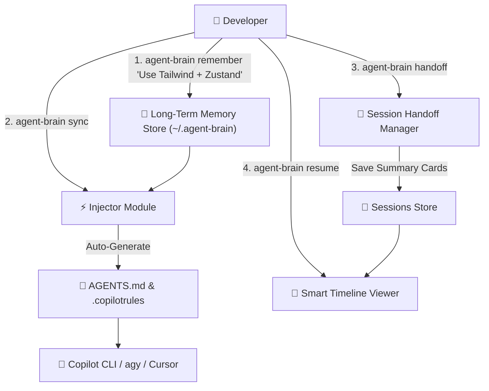

# 🧠 `agent-brain`: Long-Term Memory & Smart Resume Gateway Agent CLI

> Persistent Long-Term Memory Gateway and Smart Resume assistant for Copilot CLI, `agy`, Claude Code, and Cursor. Stop re-teaching your AI Agent every single session!

[ English ](README.md) | [ 繁體中文 ](README_zh-TW.md)


---

## 🌟 Key Features

* **🧠 Persistent Long-Term Memory (`remember` & `sync`)**: Store your developer coding preferences, conventions, and project rules once. Auto-injects them into `AGENTS.md` and `.copilotrules` so Copilot CLI & AI tools recognize your rules from second 1.
* **📜 Smart Resume Timeline (`resume`)**: Replaces vague native `/resume` session IDs with human-readable timeline cards displaying **Goal**, **Files Modified**, **Key Decisions**, and **Unfinished TODOs**.
* **🔍 Semantic & Keyword Memory Search (`find`)**: Search past session handoffs and developer rules with a single command.
* **📝 End-of-Session Handoff (`handoff`)**: Save progress snapshots at the end of the day for seamless continuation tomorrow.

---

## 🏗️ Architecture



---

## 🚀 Quick Start

### 1. Store Your Global Rules
```bash
agent-brain remember "Prefer Rust/TypeScript, modular architecture, write self-documenting code"
```

### 2. Inject Context into Current Project
```bash
agent-brain sync
```

### 3. Create Session Handoff Snapshot
```bash
agent-brain handoff
```

### 4. Smart Resume Timeline
```bash
agent-brain resume
```

---

## 📄 License

MIT License © 2026 BingFengHung
