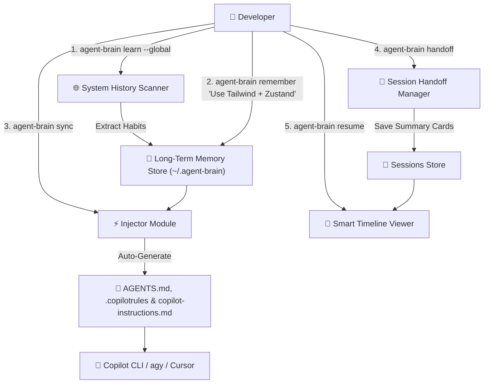

# 🧠 `agent-brain`: Long-Term Memory & Smart Resume Gateway Agent CLI

> Persistent Long-Term Memory Gateway and Smart Resume assistant for Copilot CLI, `agy`, Claude Code, and Cursor. Stop re-teaching your AI Agent every single session!

[ English ](README.md) | [ 繁體中文 ](README_zh-TW.md)


---

## 🌟 Key Features

* **🔄 Auto-Self Update (`agent-brain update`)**: Automatically checks GitHub Releases for new binary releases and performs an atomic in-place update of the CLI executable!
* **🌐 Global System History Auto-Learning (`agent-brain learn --global`)**: Automatically scans your system shell history (PowerShell / Zsh / Bash) and past AI CLI sessions to learn your package managers, language preferences, and CLI habits without entering a project folder or typing a single word!
* **🔍 Local Codebase Auto-Learning (`agent-brain learn`)**: Scans existing project manifest files (`package.json`, `Cargo.toml`, `tsconfig.json`, `pyproject.toml`, `.git`) to extract tech stack rules and code conventions.
* **🧠 Persistent Long-Term Memory (`remember` & `sync`)**: Store your developer coding preferences and project rules. Auto-injects them into `AGENTS.md`, `.copilotrules`, and `.github/copilot-instructions.md` so Copilot CLI & AI tools recognize your rules from second 1.
* **📜 Smart Resume Timeline (`resume`)**: Replaces vague native `/resume` session IDs with human-readable timeline cards displaying **Goal**, **Files Modified**, **Key Decisions**, and **Unfinished TODOs**.
* **🔍 Semantic & Keyword Memory Search (`find`)**: Search past session handoffs and developer rules with a single command.
* **📝 Autonomous Zero-Typing Handoff (`handoff --auto`)**: Automatically analyzes Git status, modified files, and session metadata to create instant end-of-day progress snapshots—100% inside `agy` or Copilot CLI without typing a single word!

---

## 🏗️ Architecture



---

## 🚀 Quick Start

### 1. Global History Auto-Learning (No Project Folder Needed)
```bash
agent-brain learn --global
```

### 2. Auto-Learn from Existing Codebase
```bash
agent-brain learn
```

### 3. Store Custom Global Rules (Optional)
```bash
agent-brain remember "Prefer Rust/TypeScript, modular architecture, write self-documenting code"
```

### 4. Inject Context into Current Project
```bash
agent-brain sync
```

### 5. Create Session Handoff Snapshot
```bash
agent-brain handoff
```

### 6. Smart Resume Timeline
```bash
agent-brain resume
```

---

## 📄 License

MIT License © 2026 BingFengHung
