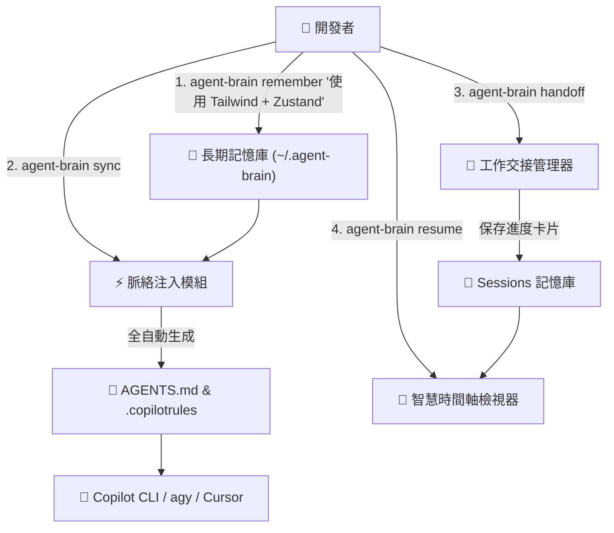

# 🧠 `agent-brain`: AI Agent 長期記憶與智慧恢復 CLI 外掛

> 專為 Copilot CLI、`agy`、Claude Code 與 Cursor 打造的長期記憶與智慧恢復門戶工具。告別每次開啟 AI Agent 都需要重新教學的痛苦！

[ English ](README.md) | [ 繁體中文 ](README_zh-TW.md)


---

## 🌟 核心特色

* **🧠 長期記憶與脈絡自動注入 (`remember` & `sync`)**：記錄個人開發習慣與專案架構規範，自動同步生成 `AGENTS.md` 與 `.copilotrules`，讓 Copilot CLI 第一秒就認識你。
* **📜 智慧恢復時間軸 (`resume`)**：取代 Copilot 原生冰冷的 `/resume` 會話 ID，用結構化卡片清晰展示上次的 **完成目標**、**修改檔案**、**關鍵決策** 與 **遺留待辦**。
* **🔍 歷史記憶與決策搜尋 (`find`)**：透過關鍵字瞬間搜尋過往所有會話紀錄與記憶。
* **📝 每日工作交接快照 (`handoff`)**：下班前一鍵記錄今天進度，明天開啟 Seamless 無縫接續。

---

## 🏗️ 系統架構圖



---

## 🚀 快速開始

### 1. 儲存個人開發偏好
```bash
agent-brain remember "偏好 Rust/TypeScript、模組化架構、撰寫自解釋程式碼"
```

### 2. 同步記憶至當前專案
```bash
agent-brain sync
```

### 3. 下班建立交接快照
```bash
agent-brain handoff
```

### 4. 查看智慧恢復時間軸
```bash
agent-brain resume
```

---

## 📄 開源授權

MIT License © 2026 BingFengHung
