# 🧠 `agent-brain`: AI Agent 長期記憶與智慧恢復 CLI 外掛

> 專為 Copilot CLI、`agy`、Claude Code 與 Cursor 打造的長期記憶與智慧恢復門戶工具。告別每次開啟 AI Agent 都需要重新教學的痛苦！

[ English ](README.md) | [ 繁體中文 ](README_zh-TW.md)


---

## 🌟 核心特色

* **🌐 系統全域歷程自動學習 (`agent-brain learn --global`)**：全自動掃描您本機的 Shell 歷史紀錄 (PowerShell / Zsh / Bash) 與過往 AI 會話，無需進入特定專案或打任何字，自動學習您的套件管理工具、語言偏好與 CLI 習慣！
* **🔍 自動汲取既有專案經驗 (`agent-brain learn`)**：掃描您現有的專案檔（`package.json`, `Cargo.toml`, `tsconfig.json`, `pyproject.toml`, `.git`），自動分析出您當前專案的技術棧與框架規範！
* **🧠 長期記憶與脈絡自動注入 (`remember` & `sync`)**：記錄個人開發習慣與專案架構規範，自動同步生成 `AGENTS.md`、`.copilotrules` 與 `.github/copilot-instructions.md`，讓 Copilot CLI 與 VS Code 第一秒就認識您。
* **📜 智慧恢復時間軸 (`resume`)**：取代 Copilot 原生冰冷的 `/resume` 會話 ID，用結構化卡片清晰展示上次的 **完成目標**、**修改檔案**、**關鍵決策** 與 **遺留待辦**。
* **🔍 歷史記憶與決策搜尋 (`find`)**：透過關鍵字瞬間搜尋過往所有會話紀錄與記憶。
* **📝 全自動零打字工作交接 (`handoff --auto`)**: 自動讀取 Git 修改檔案、Commit 記錄與環境脈絡，直接在 `agy` 或 Copilot CLI 內部一秒完成下班進度交接快照，一字都不需要手打！

---

## 🏗️ 系統架構圖

```mermaid
graph TD
    User["👤 開發者"] -->|1. agent-brain learn --global| Sys["🌐 全域歷程掃描器"]
    Sys -->|汲取習慣| Mem["🧠 長期記憶庫 (~/.agent-brain)"]
    User -->|2. agent-brain remember '使用 Tailwind + Zustand'| Mem
    User -->|3. agent-brain sync| Inj["⚡ 脈絡注入模組"]
    Mem --> Inj
    Inj -->|全自動生成| AgtMD["📄 AGENTS.md, .copilotrules & copilot-instructions.md"]
    
    AgtMD --> Copilot["🤖 Copilot CLI / agy / Cursor"]
    
    User -->|4. agent-brain handoff| Hand["📝 工作交接管理器"]
    Hand -->|保存進度卡片| Snap["📅 Sessions 記憶庫"]
    User -->|5. agent-brain resume| View["📜 智慧時間軸檢視器"]
    Snap --> View
```



---

## 🚀 快速開始

### 1. 全域歷程自動學習（無需進入專案資料夾）
```bash
agent-brain learn --global
```

### 2. 既有專案經驗自動學習
```bash
agent-brain learn
```

### 3. 儲存自訂個人開發偏好 (可選)
```bash
agent-brain remember "偏好 Rust/TypeScript、模組化架構、撰寫自解釋程式碼"
```

### 4. 同步記憶至當前專案
```bash
agent-brain sync
```

### 5. 下班建立交接快照
```bash
agent-brain handoff
```

### 6. 查看智慧恢復時間軸
```bash
agent-brain resume
```

---

## 📄 開源授權

MIT License © 2026 BingFengHung
